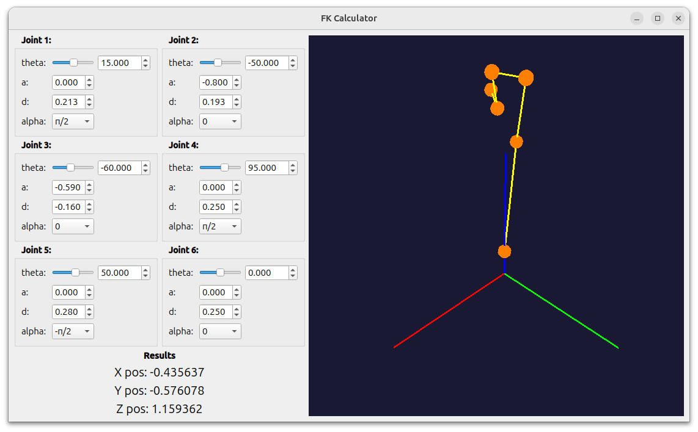

# FK Calculator - Forward Kinematics Calculator

## Описание проекта

Программа для расчета прямой кинематики (Forward Kinematics).
Имеет функцию визуализации 6-ти звенной системы. 


## Системные требования

- **Поддерживаемые ОС**: Ubuntu 24.04 LTS (рекомендуется)
- Для Ubuntu 22.04 рекомендуется использовать Docker-образ

## Установка

### Способ 1: Установка DEB-пакета

1. Скачайте последнюю версию DEB-пакета из [раздела Releases](https://github.com/dekotya/FK-Calculator/releases)
2. Установите пакет:

```bash
sudo apt install ./FK_Calculator-1.0.0-Linux.deb
```

3. Запустите программу:

```bash
FK_Calculator
```

### Способ 2: Сборка из исходников

```bash
# Установите зависимости
sudo apt update && sudo apt install -y build-essential cmake qt6-base-dev freeglut3 libglu1-mesa-dev

# Клонируйте репозиторий
git clone https://github.com/ваш-username/FK-Calculator.git
cd FK-Calculator

# Соберите проект
mkdir build && cd build
cmake ..
make -j$(nproc)

# Установите (опционально)
sudo make install
```
